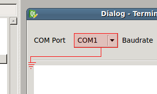
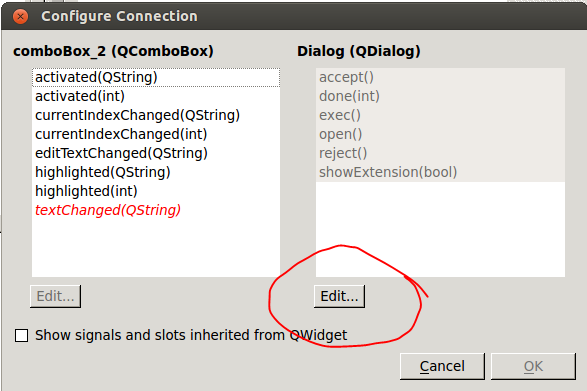
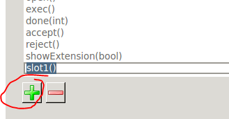
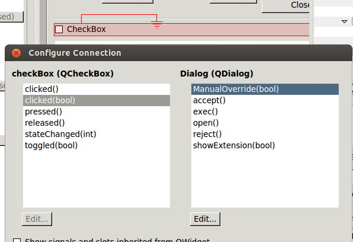

# Qt4 GUIBinder/builder tool

This tool is meant for binding your python application code to a Qt4 GUI. The idea is that the application can live in its own file, and is binded into the GUI application via the `GUIBinder.py` tool.

## Rationale
The "generator" `pyuic4` is used to create a python script from a `*.ui` file, the challenge is that if you need to do changes to the GUI (`*.ui`) file you have to either, do it via the Qt4 Designer and re-run the `pyuic4` tools accept that the changes you made to the generated python script is lost, or do the changes manually directly in the python file.

## Usage
1. Start Qt4 Designer and choose "New Form", then make sure to choose a Dialog of some sort (with buttons, without), current version only support the type Ui_Dialog.
2. Design your GUI as normal.
3. To bind button, text box, slider, and so on, functions used the `Edit Signals/Slots` tool in Qt4 (shortcut F4 in Qt4 Designer), then bind the functions you wish to call from your main application to the From/Dialog itself.


When choosing the function to call, press the `Edit...` button on the right hand side of the Dialog.


Then press the green plus under Slots


and type your function name, connect this function in the previous dialog after clicking `OK`in the current dialog.


4. Then write you `[application].py` file with a single class that contain all your functions you wish to call from your GUI. E.g. something like this:
```python
class MainApplication(object):
	ui = None
	number = 0
	def __init__(self, gui=None):
		self.ui = gui
	def SendMessage(self):
		print("Sending a message from the GUI to console")
	def SetNumber(self, number):
		self.ui.progressBar.setValue(number)
	def MyTest(self):
		self.ui.label.setText("%u" % self.number)
		self.number += 1
	def ManualOverride(self, pushed):
		print "Manual override:",
		print pushed
	def SomeTextEntered(self):
		print "Hei %s" % self.ui.name.text()
```
5. Add code for initializing and showing the GUI:
```python
if __name__ == "__main__":
	from GUI import *
	from PyQt4 import QtGui

	app = QtGui.QApplication(sys.argv)
	Dialog = QtGui.QDialog()
	ui = Ui_Dialog()
	ui.setupUi(Dialog)

	Dialog.show()
	sys.exit(app.exec_())
```
The line `from GUI import *` is importing the actual generated GUI file, which in this case is named `GUI.py`.
6. When this is done run the commands:
```
pyuic4 -x -o [python GUI file].py [Qt4 saved GUI file].ui
python GUIBinder.py -g [python GUI file].py -a [your appfile with class from 5].py
```
Ex.:
```
pyuic4 -x -o GUI.py mygui.ui
python GUIBinder.py -g GUI.py -a GUIApp.py
```
(a better alternative is to use a Makefile from one of the examples)
